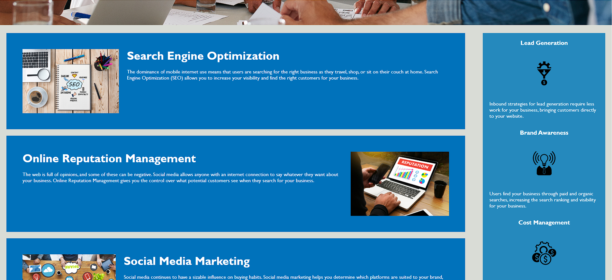
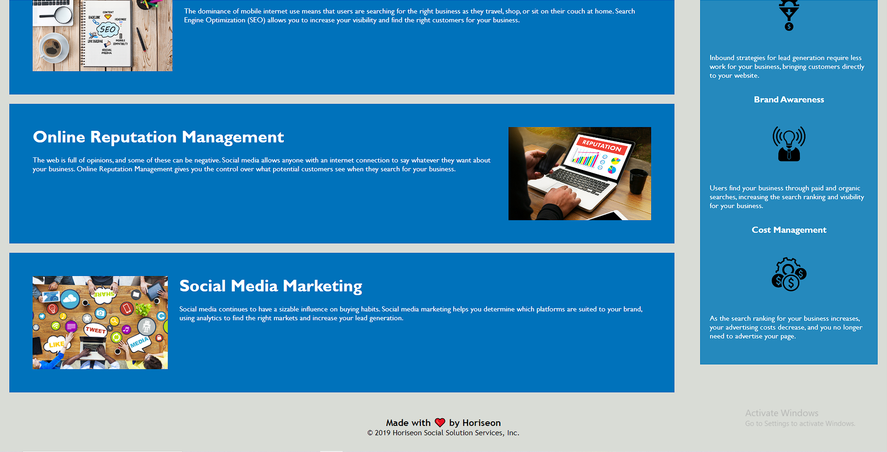

# Module-1-Challenge

## Description

This challenge was an on-the-job ticket that consisted of refactoring the existing code of a marketing agency called Horiseon.

The reason for refactoring was to both improve the website's search engine optimization ranking and its accessibility for disabled people using assistive technologies.

I was able to learn more about the default settings for many attributes, more detailed semantic language in HTML and CSS, and how to optimize selectors in CSS files for efficient viewing and use.

## Table of Contents
- [Commit-Notes](#commit-notes)
- [Initial-Commit](#initial-commit)
- [Commit-2](#commit-2)
- [Commit-3](#commit-3)
- [Commit-4](#commit-4)
- [Commit-5](#commit-5)
- [Commit-6](#commit-6)
- [Screenshots](#screenshots)
- [Screenshot-1](#screenshot-1)
- [Screenshot-2](#screenshot-2)
- [Screenshot-3](#screenshot-3)
- [Link](#link)

## Commit Notes

### Initial Commit:
	• Uploaded starter code "index.html" and "assets" folder with both "css" and "images" folders

### Commit 2:
	• Removed div from the header and all the unnecessarily added selectors for the header's children from the css file (header, ul, and li element selectors used instead)
	• Changed the ".header" class to select the <header> element instead, and changed 
 to <header>
	• Created new class ".newheader" to replace ".header div" class in the CSS file, kept all the properties within its brackets the same
	• Fixed indentation
	• Changed all 
 to <section>
	• Re-ordered the CSS file so the classes within the ".content" parent class are all above the ".benefits" class
	• Changed the ".footer" class to select the "footer" element instead
	• Changed 
 to <main class="content"> to specify the main body of content within the webpage
	• Changed 
 to <aside class="benefits"> to specify content that should be on the side of the webpage
	• Changed <title> to "Official Horiseon Website" instead of "website"

### Commit 3:
	• Added alt statements to describe all the images and icons for accessibility
	• Changed every 
 child element within the  <aside> parent element to <section>
	• Changed h3 from being selected within the ".benefits" class and made an h3 selector at the top of the CSS file under h2
	• Reordered the universal, element, class, and ID selectors in the CSS file to be in the proper order (in the order listed)
	• Moved the attributes added to "h2" to "h4"
	• Removed ".search-engine-optimization h2", ".online-reputation-management h2", and ".social-media-marketing h2" class selectors from the CSS file and moved the attributes within them to "h2"
	• Replaced <h2> within <footer> element with <h4>
	• Removed all the "id" elements within the HTML file, as they are classes and not ID's

### Commit 4:
	• Changed around a bit of the CSS file order
	• Removed the alt statement from 
 after checking HTML file with HTML Validator
	• Replaced ".benefit-brand img", ".benefit-lead img", and ".benefit-cost img" with a new class, ".aside-icons" and added this class to all three images in the <aside> sections
	• Removed ".benefit-brand", ".benefit-lead", and ".benefit-cost" and added their attributes to a new class, ".benefit-sections", then replaced these classes in the HMTL file all with ".benefit-sections"

### Commit 5:
	• Fixed indentation of the HTML and CSS files

### Commit 6:
	• Reorganized the CSS element selectors to their ideal order
	• Removed "p" element selector (unnecessary, as 16px is the default)
	• Combined attribute "font-family" into one "header, footer" element selector because it was the same for both
	• Added comments to the CSS file to label the various selector types
	• Added ID's for #search-engine-optimization, #online-reputation-management, and #social-media-marketing so that the navigation bar could be linked to them
	• Removed the ".benefits" class selector and removed it from the HTML file, as well, then took the attributes under ".benefits" and moved them under "aside" element selector, which I created in the CSS file
	• Removed ".newheader" class selector from both CSS and HTML files, then moved all the attributes under it to the "ul" element selector instead
	• Removed ".seo" class selector and moved its attributes to newly created "span" element selector, then removed "seo" class from the HTML file
	• Completed first draft of the README file (missing the deployed application link)
    • Added screenshots of the website to the "images" folder in the Module-01-Challenge repository

## Screenshots

### Screenshot #1:

### Screenshot #2:

### Screenshot #3:

## Link

